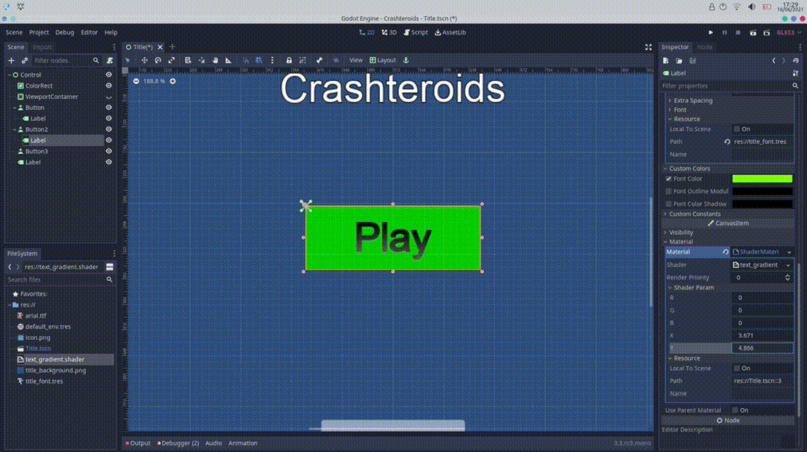

# godot-text-gradient-shader
Allows you to add a gradient to text in godot (thereoetically other stuff too)

(You would probably want to edit this shader since it is quite buggy...)

## How to use:

Download the [text_gradient.shader](text_gradient.shader)  file, and add it to a material on the text label object in your game, adjust the paramaters of the shader if needed in the editor.
